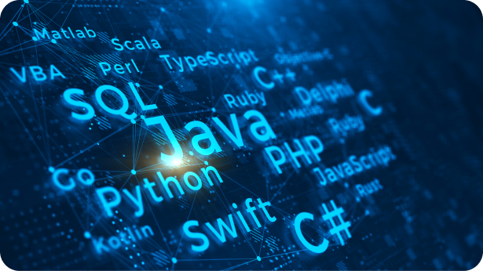
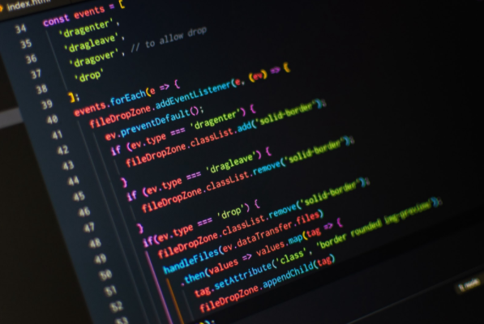
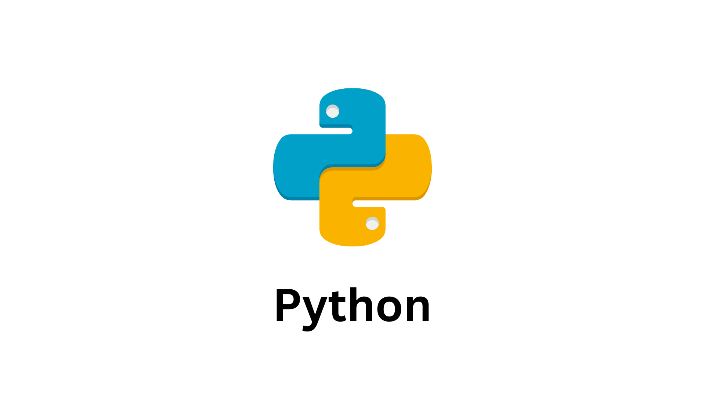
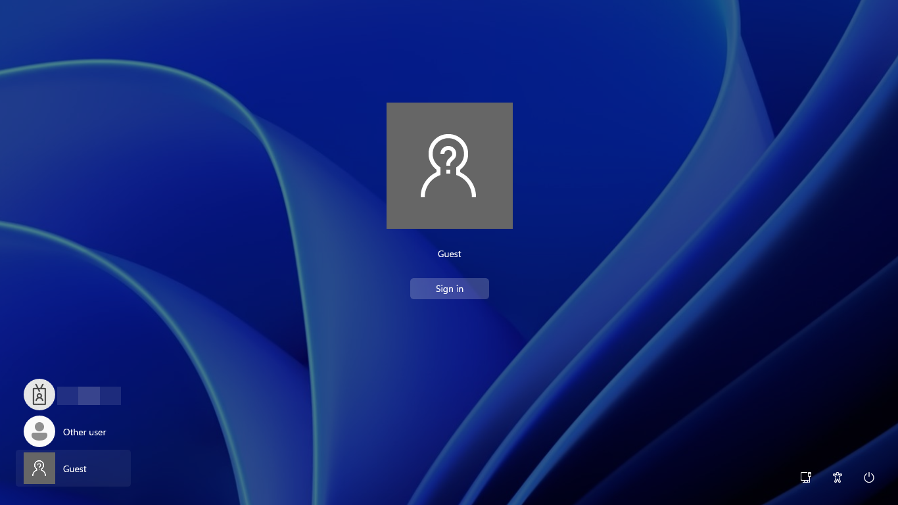
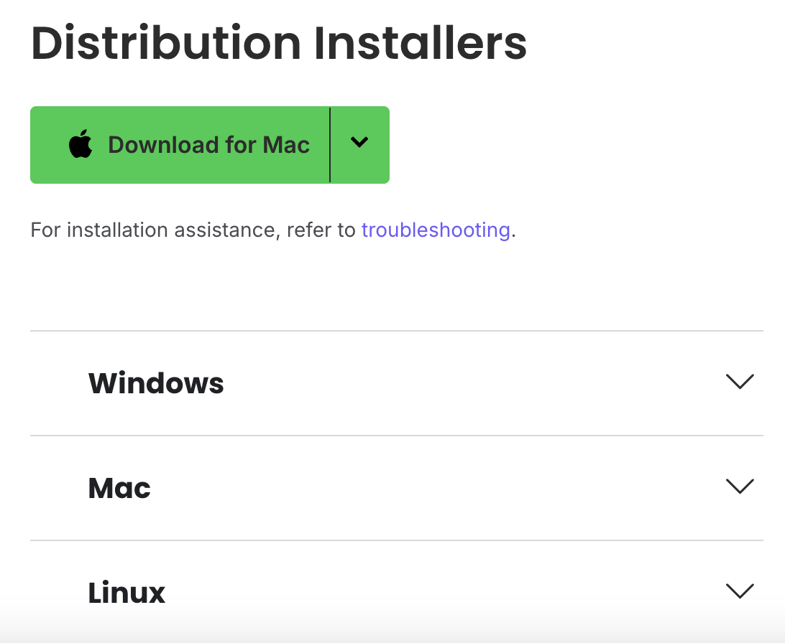
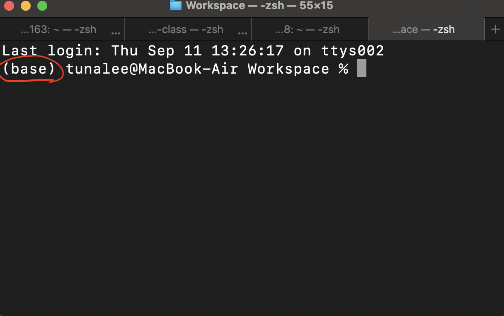
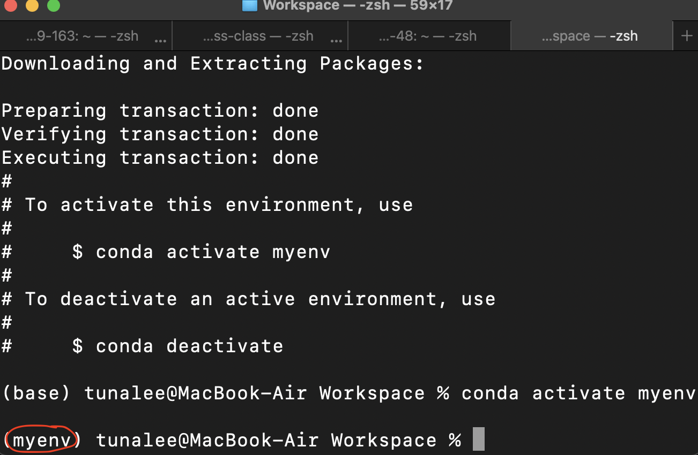
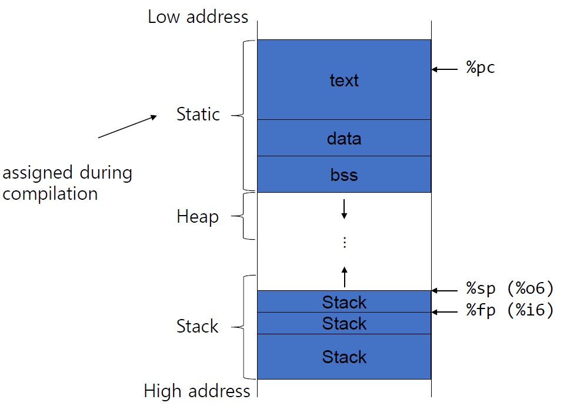

# 파이썬 프로그래밍 입문

프로그래밍 & 파이썬 실행 & 변수 및 입출력

---

# GOAL
  - 프로그래밍 핵심 개념
  - **인터프리터 vs 컴파일러** 특징 비교
  - **아나콘다 설치 & 가상환경** (Windows / Mac)
  - `print()`와 **주석 + 텍스트 다루기** 응용까지
- 변수란 무엇인가?  
- 함수를 왜 쓰는가?  
- 변수와 함수의 기본 문법 익히기  

---

# 목차
1) 프로그래밍이란?  
2) 인터프리터 vs 컴파일러 (파이썬 중심)  
3) 아나콘다 설치 & 가상환경 (Windows / Mac)
4) 변수란?
5) 함수란?
6) 파이썬 입출력

---

## 1. 프로그래밍이란?


---
## 1. 프로그래밍이란?


### 사람↔사람 = 말

- 사람끼리는 말(자연어)로 의사소통  


---
## 1. 프로그래밍이란?

### 사람↔컴퓨터 = 프로그래밍
- 컴퓨터에게는 정확한 규칙의 언어(프로그래밍 언어)가 필요
---


---
## 왜 “정확한 표현”이 중요할까?
- 컴퓨터는 **눈치가 없다** → 모호한 말 X
- 순서, 조건, 반복 등을 **명확하게** 적어야 함

---

## 2. 인터프리터 vs 컴파일러


---

### “언제 번역하느냐”의 차이

- **인터프리터**: 한 줄씩 읽고 바로 실행 (동시통역사)
- **컴파일러**: 전체를 기계어로 변환 후 실행 (완역본 책)
---

## 2-1. 인터프리터
- **즉시 실행** & **빠른 피드백** (REPL, Jupyter 등)
- 배우기/디버깅 쉬움, 실습 속도 빠름
- 대표: **Python**, JavaScript, Ruby, PHP, R
---


---
## **파이썬 장점**
- 문법이 **간결**하고 **가독성** 높음
- **AI/데이터/웹/자동화** 생태계 풍부 (NumPy, pandas, Flask, FastAPI 등)
- 입문하기 쉽다!
---

## 2-2. 컴파일러
- 실행 전 **한번 번역** → **실행 속도 빠름**, **최적화** 강함
- 대표: C, C++, Go, Rust  
- 대규모/성능 민감한 시스템에 적합

---

| 구분 | 인터프리터 | 컴파일러 |
|---|---|---|
| 번역 시점 | 실행 중(줄 단위) | 실행 전(전체) |
| 피드백 | 빠름 (학습/실습 용이) | 느릴 수 있음 (빌드 필요) |
| 실행 속도 | 상대적 느림 | 빠름/최적화 |
| 대표 언어 | Python, JS | C, C++, Go, Rust |

---

## 실전에서 어떻게 쓰이나?
- **파이썬(인터프리터)**:  
  데이터 분석 노트북(Jupyter), 자동화 스크립트, 웹 백엔드, 교육, AI/ML 프로토타이핑
- **컴파일 언어**:  
  고성능 서버, 게임 엔진, 임베디드, 네이티브 앱

---

## 3. 아나콘다 설치 & 가상환경 (Windows / Mac)


---

### 왜 일반 파이썬 대신 아나콘다?

- **올인원 패키지**: Python + 패키지 관리자(conda) + 과학 패키지 다수
- 복잡한 과학 라이브러리(NumPy, SciPy 등) 설치가 **매우 쉬움**
- **가상환경 관리** 내장 (프로젝트별 분리)
---


---
## 가상환경이 꼭 필요한 이유
- 프로젝트 A는 numpy 1.26, B는 2.x 필요 → **버전 충돌 방지**
- **컴퓨터 사용자**가 여러 명일 때 느낌

---


---

## 설치
1) 아나콘다 공식 사이트에서 OS에 맞는 설치 파일 다운로드  
2) **기본 옵션**으로 설치 (PATH 자동 등록 권장)  
3) https://www.anaconda.com/download

---


---


---


---

##가상환경 만들기 (conda)
```bash
# 새 환경 만들기
conda create -n myenv python=3.12

# 환경 활성화
conda activate myenv
```

## TIP
- 환경 목록 보기: conda env list
- 환경 삭제: conda remove -n myenv --all
---



---

# Jupyter Notebook 실행

- mac환경은 설치를 해야함
```bash
brew install jupyterlab
```
또는
```bash
pip install jupyter
```
- window환경은 Anaconda 설치 시 자동으로 설치
---


# 4. 변수

변수 = 데이터를 저장하는 이름표  
메모리 = 컴퓨터의 **창고 공간**  

👉 변수는 **메모리의 한 칸을 가리키는 라벨(주소표)**


---
## 비유
- 메모리 = 사람의 뇌 🧠
- 변수 = 기억을 불러낼 때 쓰는 “이름표”
- 값 = 실제 기억 내용  

---


---

# 변수 규칙  

✔ 알파벳, 숫자, 밑줄(_) 사용 가능  
✔ 숫자로 시작 불가  
✔ 대소문자 구분  

```python
name = "철수"
Name = "영희"
print(name)  # 철수
print(Name)  # 영희
```

❌ 예약어 사용 불가 (`if`, `for`, `class` 등)  

---

# 변수의 값 바꾸기  

```python
x = 5
print(x)   # 5

x = 10
print(x)   # 10
```

👉 새로운 값이 들어오면 **덮어쓰기** 된다.  

---

# 함수 (Function)  

- **자주 쓰는 코드 묶음**  
- 필요할 때마다 꺼내서 실행 

---
# 함수를 왜 써야하는가?

1) 재사용 → 같은 코드 반복 X

2) 정리 → 코드가 깔끔해짐

3) 가독성 → 이름만 봐도 무슨 일 하는지 알 수 있음

4) 유지보수 → 문제 난 부분만 수정

5) 확장성 → 쉽게 업그레이드 가능

---
# 기본 함수
```python
def greet():
    print("안녕하세요!")

greet()
# 안녕하세요!
```
---

# 함수 매개변수 (Parameter)  

```python
def greet(name):
    print("안녕하세요,", name, "님!")

greet("영희")
greet("철수")

# 안녕하세요, 영희 님!
# 안녕하세요, 철수 님!
```

---

# 함수 반환값 (Return)  

```python
def add(a, b):
    return a + b

result = add(3, 5)
print("결과:", result)
# 결과: 8
```

---

# 변수 + 함수 활용  

```python
def square(x):
    return x * x

num = 4
print(num, "의 제곱은", square(num))
# 4 의 제곱은 16
```
---

# 함수 & 변수 정리  

- 변수 = 데이터를 담는 이름표
- 함수 = 코드 묶음 (자동판매기)
- 매개변수 = 입력값  
- 반환값 = 결과물  

### 변수와 함수는 **코드의 기본 단위**  
---

# 출력 (Output)  

- `print()` 함수 사용  
- 원하는 내용을 화면에 보여줌  

```python
print("안녕하세요!")
print(123)
# 안녕하세요!
# 123
```
---

# 여러 개 출력  

- 콤마(,)로 여러 개 나열 가능  
- 자동으로 띄어쓰기 한 칸 삽입  

```python
print("이름:", "철수")
print("나이:", 20, "살")
# 이름: 철수
# 나이: 20 살
```

---

# 출력 옵션  

- `sep` : 구분자 설정  
- `end` : 줄 끝 문자 설정  

```python
print("A", "B", "C", sep="-")
print("Hello", end=" ")
print("World")
# A-B-C
# Hello World
```

---

# 입력 (Input)  

- `input()` 함수 사용  
- 키보드로 입력받아 **문자열**로 저장됨  

```python
name = input("이름을 입력하세요: ")
print("안녕하세요,", name)
# 이름을 입력하세요: 철수
# 안녕하세요, 철수
```

---

# 숫자 입력  

- `input()`은 문자열만 받음  
- 숫자가 필요하면 **형 변환** 필요 (`int()`, `float()`)

```python
age = int(input("나이를 입력하세요: "))
print("내년에는", age + 1, "살이 됩니다!")
# 나이를 입력하세요: 20
# 내년에는 21 살이 됩니다!
```

---

# 응용 예시  

✏️ 간단한 덧셈 계산기  

```python
a = int(input("첫 번째 숫자: "))
b = int(input("두 번째 숫자: "))
print("합계:", a + b)

# 첫 번째 숫자: 10
# 두 번째 숫자: 5
# 합계: 15
```

---

# 출력 서식 1 (f-string)  

```python
name = "영희"
age = 18
print(f"안녕하세요, {name}님! 나이는 {age}살이군요.")

# 안녕하세요, 영희님! 나이는 18살이군요.
```

---

# 🖼 출력 서식 2 (`format`)  

```python
print("안녕하세요, {}님! 나이는 {}살.".format("민수", 25))

# 안녕하세요, 민수님! 나이는 25살.
```

---

# 입출력 정리  

- `print()` : 결과 출력  
- `input()` : 사용자 입력 받기
- 입력은 항상 문자열! → 숫자는 `int()` / `float()` 변환 필요  
- 출력 서식: f-string / format  

---
# 실습 과제
- 자기소개 프로그램 만들기
- BMI 계산기 제작