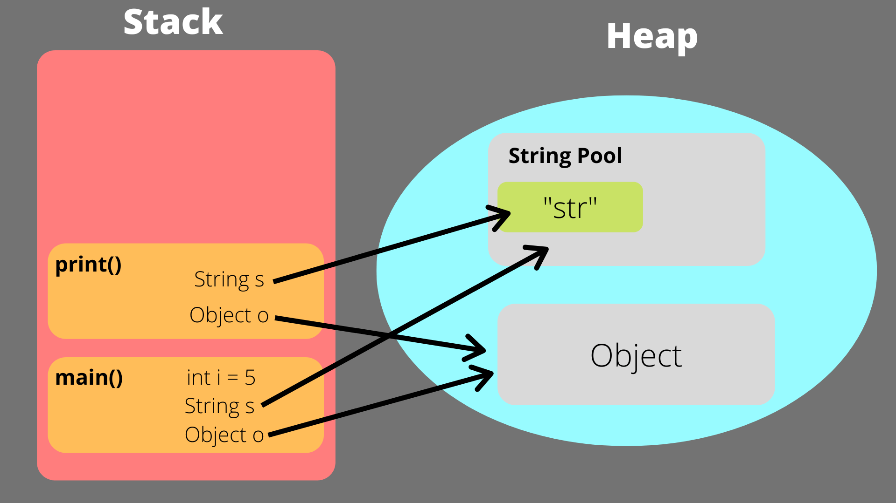
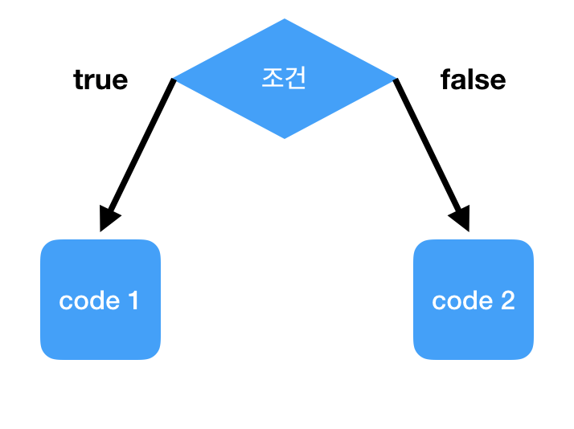

# 파이썬 데이터 타입(1)

Primitive & 메모리 동작 원리

## GOAL

- Primitive와 Reference 타입의 차이 이해
- 각 데이터 타입(Primitive) 의 특성과 메서드 활용
- 메모리 관점에서의 동작 원리 파악


## 데이터 타입이란?


---


## Python 데이터 타입 분류

**Primitive (불변)**
- `int`, `float`, `bool`, `str`, `NoneType`

**Reference (대체로 가변)**
- `list`, `dict`, `set`, `tuple`
- tuple은 불변이지만 참조형으로 분류
---


## Primitive vs Reference

Primitive: 실제 값을 저장 (ex: x = 10)

Reference: **주소(위치)** 를 저장 (ex: arr = [1,2,3])


## 변수와 메모리 동작 원리

변수는 **메모리 주소를 가리키는 이름표**

```python
x = 10       # 1) 10 객체 생성
             # 2) x가 그 주소를 가리킴

y = x        # 3) y도 같은 주소 참조
print(id(x)) # 주소 확인
print(id(y)) # 같은 주소
```

## 정수형 (int) — Primitive

특징
- 불변(값 변경 시 새 객체 생성)
- 무한 정밀도 (메모리 한도)
- 작은 정수 캐싱: `-5 ~ 256`

```python
num1 = 42
big = 123456789012345678901234567890
binary = 0b1010   # 10
octal = 0o777     # 511
hexa = 0xFF       # 255
print(binary, octal, hexa)
```

## int 내장함수
int() (형 변환)

- 문자열, 실수, 진법 문자열을 정수로 바꿀 때 가장 많이 사용
```py
print(int("123"))     # 문자열 → 123
print(int(12.9))      # 실수 → 12 (소수점 버림)
print(int("1010", 2)) # 2진수 문자열 → 10
```

## 실수형 (float) — Primitive

특징
- IEEE 754, 64비트 부동소수
- 정밀도 약 15–17자리
- 특수값: `inf`, `-inf`, `nan`

```python
import math
print(0.1 + 0.2)         # 0.30000000000000004
print(0.1 + 0.2 == 0.3)  # False
print(math.isclose(0.1 + 0.2, 0.3))  # True
```
## 내장 수학 함수
- import 없이 바로 쓸 수 있음
- https://wikidocs.net/32
1) abs(x)
- 절댓값 반환
```py
print(abs(-5))   # 5
print(abs(3.7))  # 3.7
```
---
2) pow(x, y) 와 **
- 거듭제곱 (x^y)
```py
print(pow(2, 3))   # 8
print(2 ** 3)      # 8 (같은 결과)
```
---
3) round(x, n)
- 반올림 (소수점 n자리까지)
```py
print(round(3.14159, 2))  # 3.14
print(round(123.456, 0))  # 123.0
```
## Math 모듈
- import 필요
1) 제곱근 & 거듭제곱
```py
import math
print(math.sqrt(16))   # 4.0
print(math.pow(2, 5))  # 32.0
```
---
2) 올림, 내림, 버림
```py
print(math.ceil(3.2))  # 4 (올림)
print(math.floor(3.8)) # 3 (내림)
print(math.trunc(3.9)) # 3 (버림)
```
---
내장 함수: abs(), pow(), round()

math 모듈: sqrt(), pow(), ceil(), floor(), trunc(), gcd(), lcm(), log(), exp(), sin(), cos(), tan(), pi, e
## 문자열 (str) — Primitive

특징
- 불변, 순서 보장, 유니코드

```python
text = "Python"
print(text[0])    # 'P'
print(text[-1])   # 'n'
print(text[1:4])  # 'yth'
print(text[::-1]) # 'nohtyP'
```

## 문자열 길이: len()

```python
text = "Hello"
print(len(text))  # 5
```

-  글자 수를 센다. (띄어쓰기 포함)


## 대소문자 변환

```python
s = "python"
print(s.upper())  # "PYTHON"
print(s.lower())  # "python"
print("hello".capitalize()) # "Hello"
```

- `upper()` : 대문자로
- `lower()` : 소문자로
- `capitalize()` : 첫 글자만 대문자


## 공백 제거: strip()

```python
s = "   hello   "
print(s.strip())   # "hello"
print(s.lstrip())  # "hello   "
print(s.rstrip())  # "   hello"
```

- 문자열 앞뒤 불필요한 공백 제거  


## 찾기: find(), index()

```python
s = "banana"
print(s.find("na"))   # 2
print(s.find("xy"))   # -1 (없음)
print(s.index("na"))  # 2
```

- `find()` : 위치 반환, 없으면 -1  
- `index()` : 위치 반환, 없으면 에러  


## 포함 여부: in

```python
s = "apple pie"
print("apple" in s)   # True
print("banana" in s)  # False
```

- 문자열도 시퀀스라서 in 사용 가능  


## 분리하기: split()

```python
s = "a,b,c"
print(s.split(","))   # ['a', 'b', 'c']
```

- 문자열 → 리스트 변환  


## 합치기: join()

```python
words = ["a", "b", "c"]
print("-".join(words))  # "a-b-c"
```

- 리스트 → 문자열 변환  


## 교체하기: replace()

```python
s = "I like Java"
print(s.replace("Java", "Python"))
# "I like Python"
```


## 반복하기 & 곱하기

```python
print("ha" * 3)  # "hahaha"
```

- 문자열은 숫자와 곱하면 반복된다  

## 판별 메서드

```python
print("123".isdigit())    # True
print("abc".isalpha())    # True
print("abc123".isalnum()) # True
print("python".islower()) # True
print("PY".isupper())     # True
```


# 요약

- **변환**: `upper(), lower(), capitalize()`  
- **공백 제거**: `strip()`  
- **검색**: `find(), index(), in`  
- **분리/합치기**: `split(), join()`  
- **교체**: `replace()`  
- **판별**: `isdigit(), isalpha(), isalnum(), islower(), isupper()`


## 불린형 (bool) — Primitive


---
특징
- 값: `True`, `False` (정수처럼 연산 가능)

```python
print(True + True)  # 2
print(False * 10)   # 0
```

Truthy / Falsy
- Falsy: `False`, `0`, `0.0`, `""`, `[]`, `{}`, `()`, `None`
- Truthy: 그 외 대부분의 값


## 형변환 (Type Conversion)

필요성: 다른 타입과의 연산/처리를 위해

```python
age = 25
age_str = str(age)
num = int("123")
val = float("3.14")
print(bool(0), bool(""), bool([]))  # False False False, 세 가지 모두 falsy
```

```python
# 타입 검사
print(type(123) is int)
print(isinstance(3.14, float))
```

## 산술 연산자
- 숫자 끼리만 가능
```python
a, b = 17, 5
print(a + b, a - b, a * b, a / b, a // b, a % b, a ** b)
```
---
a + b : 덧셈 → 22

a - b : 뺄셈 → 12

a * b : 곱셈 → 85

a / b : 나눗셈 (실수 결과) → 3.4

a // b : 몫(정수 나눗셈) → 3

a % b : 나머지 → 2

a ** b : 거듭제곱 → 17⁵ = 1419857

- 여기서는 정수와 정수끼리 계산해야 함.

"문자열" + 3 같은 건 ❌ 에러 발생 (서로 타입이 다름).
---

문자열 특수 연산
```python
"Hello" + " " + "World"
"Py!" * 3
```

## 비교 연산자

숫자/문자열 비교

```python
x, y = 10, 20
print(x == y, x != y, x < y, x > y, x <= y, x >= y)
print("apple" < "banana")
```

주의
- 문자열은 유니코드 순서

## 논리 연산자 and
- 두 조건이 모두 True일 때만 True
```py
age = 25
has_license = True

print(age > 19 and has_license)  
# 둘 다 True여야 최종 True
```
## 논리 연산자 or
- 두 조건 중 하나라도 True면 True
```py
age = 70
is_child = False

print(age >= 65 or is_child)  
# 나이가 65세 이상이거나, 학생이면 True
```
## 논리 연산자 not
- 조건을 반대로 뒤집음 (True → False, False → True)
```py
is_student = False

print(not is_student)  
# 학생이 아니라면 True
```

## 단락 평가(Short-circuit)
```python
False and print("실행 안 됨")
True or print("실행 안 됨")
```

값 자체를 반환
```python
0 and "OK"       # 0
"A" and 123       # 123
"" or "기본값"     # "기본값"
[] or [1,2,3]     # [1,2,3]
```

## 할당 연산자

```python
x = 10

x += 5   # 10 + 5 = 15
x -= 3   # 15 - 3 = 12
x *= 2   # 12 * 2 = 24
x /= 4   # 24 / 4 = 6.0
x //= 2  # 6.0 // 2 = 3.0 (몫 연산)
x %= 2   # 3.0 % 2 = 1.0 (나머지)
x **= 3  # 1.0 ** 3 = 1.0
```

효율성
- 가독성 향상, 변수명 반복 감소
- 일부 경우 성능상 유리

## 멤버십 연산자 (in / not in)
- 어떤 값이 시퀀스에 들어 있는지 확인
```python
text = "Python Programming"
print("Python" in text)
print("Java" not in text)
```


## 조건문 기초 (if)


---
```python
age = 18
if age >= 18:
    print("성인입니다.")

score = 85
if score >= 90:
    print("A")
else:
    print("A가 아님")

if score >= 90:
    print("A")
elif score >= 80:
    print("B")
else:
    print("더 노력")
```
---
- Truthy/Falsy 활용
```python
name = input("이름: ")
if name:
    print(f"안녕하세요, {name}")
```


# 실습 과제
- 사칙연산 미니 계산기
    - int() 형변환
    - 산술 연산자
    - 불린 연산자(if/elif/else)
    - f-string 출력
- 온도 단위 변환기
    - 센티미터 입력 → 미터 변환
    - 섭씨 온도 입력 → 화씨 변환