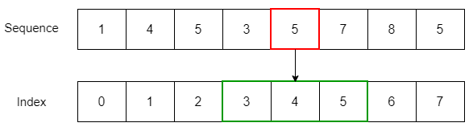

# 파이썬 데이터 타입(1)

Reference type

## GOAL

- Reference 타입(리스트, 튜플, 딕셔너리, 집합) 특징 알기
- 자주 쓰는 메서드 익히기
- 공통 특징(Iterable, Sequence, Mutable/Immutable) 이해
- Primitive vs Reference 차이 배우기
- 얕은 복사 vs 깊은 복사 경험하기

## 자료형 개념

- **Iterable**: 반복 가능한 객체 (for문에 쓸 수 있음)
- **Sequence**: 순서가 있는 자료형 (리스트, 튜플, 문자열)
- **Mutable (가변형)**: 안의 값을 바꿀 수 있음 (리스트, 딕셔너리, 집합)
- **Immutable (불변형)**: 안의 값을 못 바꿈 (정수, 실수, 문자열, 튜플)

---


## 비유  
- Immutable: 볼펜으로 쓴 글씨 (지울 수 없음)  
- Mutable: 연필로 쓴 글씨 (지웠다 쓸 수 있음)

## 리스트 (list)


## 리스트 (list)

- 순서 있음, 변경 가능 (mutable)
- 가장 자주 쓰이는 자료형
- https://wikidocs.net/14

```python
fruits = ["apple", "banana", "cherry", "orange"]
```

## 인덱스(Index)란?

- 배열/리스트 안에서 위치를 나타내는 번호
- 0부터 시작한다는 게 중요!
```py
fruits = ["apple", "banana", "cherry", "orange"]

print(fruits[0])  # apple (첫 번째)
print(fruits[1])  # banana (두 번째)
print(fruits[3])  # orange (네 번째)
```
## 음수 인덱스

- 뒤에서부터 세는 번호도 가능
- -1 = 마지막, -2 = 뒤에서 두 번째
```py
fruits = ["apple", "banana", "cherry", "orange"]

print(fruits[-1])  # orange (마지막)
print(fruits[-2])  # cherry (뒤에서 두 번째)
```
## 슬라이싱(Slicing)

- 인덱스 범위를 지정해 잘라내기
```py
fruits = ["apple", "banana", "cherry", "orange"]

print(fruits[1:3])   # ['banana', 'cherry'] (1번 이상 3번 미만)
print(fruits[:2])    # ['apple', 'banana'] (처음부터 2번 전까지)
print(fruits[2:])    # ['cherry', 'orange'] (2번부터 끝까지)
print(fruits[::2])   # ['apple', 'cherry'] (리스트[start : stop : step])

```
---

**기본 메서드**
- append(x) : 맨 뒤에 추가
- remove(x) : 값 삭제
- sort() : 정렬
- reverse() : 순서 뒤집기
- insert(i, x) : 특정 위치에 삽입
- pop(i) : 특정 위치 요소 꺼내기
- clear() : 모두 삭제
- extend(iterable) : 다른 리스트 붙이기

---
1) append(x) → 맨 뒤에 추가
```py
fruits.append("orange")
print(fruits)  
# ['apple', 'banana', 'cherry', 'orange']
```
---

2) remove(x) → 값 삭제 (처음 나오는 것만 삭제)
```py
fruits.remove("banana")
print(fruits)  
# ['apple', 'cherry', 'orange']
```
---

3) sort() → 오름차순 정렬
```py
nums = [3, 1, 4, 2]
nums.sort()
print(nums)  
# [1, 2, 3, 4]
```

- nums.sort(reverse=True) 하면 내림차순 정렬 가능
---
4) reverse() → 순서 뒤집기
```py
letters = ["a", "b", "c", "d"]
letters.reverse()
print(letters)  
# ['d', 'c', 'b', 'a']
```
---

5) insert(i, x) → 특정 위치에 삽입
```py
fruits = ["apple", "cherry"]
fruits.insert(1, "banana")
print(fruits)  
# ['apple', 'banana', 'cherry']
```
---
6) pop(i) → 특정 위치 요소 꺼내고 제거

- 인덱스 생략하면 맨 마지막 꺼냄
```py
fruits = ["apple", "banana", "cherry"]
item = fruits.pop(1)  
print(item)    # banana
print(fruits)  # ['apple', 'cherry']

last = fruits.pop()  
print(last)    # cherry
print(fruits)  # ['apple']
```
---

7) clear() → 모두 삭제
```py
fruits = ["apple", "banana", "cherry"]
fruits.clear()
print(fruits)  
# []
```
---
8) extend(iterable) → 다른 리스트/시퀀스 붙이기
```py
fruits = ["apple", "banana"]
more = ["cherry", "orange"]
fruits.extend(more)
print(fruits)  
# ['apple', 'banana', 'cherry', 'orange']
```


## 튜플 (tuple)

- 순서 있음, 변경 불가 (immutable)
- 소괄호 () 사용

```python
t = (1, 2, 3, 2)
```
---

**기본 메서드**
- count(x) : 해당 값 개수
- index(x) : 해당 값 위치

```python
print(t.count(2))  # 2
print(t.index(3))  # 2번째 위치
```

## 딕셔너리 (dict)


## 딕셔너리 (dict)

- key : value 쌍으로 저장
- 순서 없음, 가변형

```python
person = {"name": "Alice", "age": 25}
```
---
1) get(key) → 키로 값 꺼내기 (없으면 None 반환)
```py
print(person.get("name"))    # Alice
print(person.get("address")) # None (없는 키라 에러 안 나고 None)
print(person.get("address", "Unknown")) # 기본값 설정 가능
```
---
2) keys() → 모든 키 반환
```py
print(person.keys())  
# dict_keys(['name', 'age'])
```

---
3) values() → 모든 값 반환
```py
print(person.values())  
# dict_values(['Alice', 25])
```
---
4) items() → (키, 값) 쌍 튜플 반환
```py
print(person.items())  
# dict_items([('name', 'Alice'), ('age', 25)])

```
---
5) pop(key) → 키로 값을 꺼내면서 삭제
```py
age = person.pop("age")
print(age)     # 25
print(person)  # {'name': 'Alice'}
```
---
6) update({...}) → 여러 값 한꺼번에 변경/추가
```py
person.update({"age": 26, "city": "Seoul"})
print(person)  
# {'name': 'Alice', 'age': 26, 'city': 'Seoul'}
```
---
7) clear() → 모든 요소 삭제
```py
person.clear()
print(person)  
# {}
```

## 집합 (set)

- 중복 없음, 순서 없음
- 수학적 집합 연산 가능

```python
a = {1, 2, 3}
b = {3, 4, 5}
```
---
1) add(x) → 원소 추가
```py
a.add(10)
print(a)  
# {1, 2, 3, 10}
```
---
2) remove(x) → 원소 삭제 (없으면 에러)
```py
a.remove(2)
print(a)  
# {1, 3, 10}
```

- 없는 값을 remove() 하면 KeyError 발생
---
3) union(b) → 합집합
```py
print(a.union(b))  
# {1, 3, 4, 5, 10}
```

- a | b 도 같은 결과
---
4) intersection(b) → 교집합
```py
print(a.intersection(b))  
# {3}
```

- a & b 도 같은 결과
---
5) difference(b) → 차집합
```py
print(a.difference(b))  
# {1, 10}
```

- a - b 도 같은 결과
---
6) discard(x) → 원소 삭제 (없어도 에러 없음)
```py

a.discard(99)  # 없는 원소 삭제 시도
print(a)  
# {1, 3, 10}
```
---
7) clear() → 모든 원소 삭제
```py
a.clear()
print(a)  
# set()
```
## 자료형 변환 (Casting)

```python
print(list("ABC"))   # ['A','B','C']
print(tuple([1,2,3])) # (1,2,3)
print(set([1,1,2,2])) # {1,2}
print(dict([("a",1),("b",2)])) # {'a':1,'b':2}
```
💡 언제 쓸까?  
- 데이터 중복 제거 (list → set)  
- 순서 유지/변경  
- 키-값 구조 필요할 때


## is 연산자

- 의미: 두 변수가 같은 객체(같은 메모리 주소) 를 가리키는지 확인
- 값이 같아도(==) 서로 다른 객체일 수 있기 때문에 is와 ==는 다름
```py
a = [1, 2, 3]
b = a
c = [1, 2, 3]

print(a == c)  # True (값은 같음)
print(a is c)  # False (서로 다른 리스트 객체)
print(a is b)  # True (같은 객체 참조)
```
## in 연산자
- 의미: 어떤 값이 자료형 안에 포함되어 있는지 확인
```py
# list
fruits = ["apple", "banana", "cherry"]
print("apple" in fruits)     # True
print("grape" in fruits)     # False
```
## in 연산자
```py
# dict
person = {"name": "Alice", "age": 25}
print("name" in person)      # True (키 기준 검사)
print("Alice" in person)     # False (값은 직접 검사 안 함)

# 값 확인하려면 values() 사용
print("Alice" in person.values())  # True

```

## Primitive vs Reference

Primitive
- int, float, bool, str, tuple 등
- 값 변경 시 새로운 객체 생성

Reference
- list, dict, set 등
- 같은 객체를 여러 이름이 참조 가능


## Primitive vs Reference 메모리 비교

```python
# Primitive (불변)
a = 10
b = a
print(id(a), id(b))  # 같을 수 있음
a = 20               # 새 객체
print(id(a))         # 달라짐
```
---
```python
# Reference (가변)
list1 = [1,2,3]
list2 = list1
list1.append(4)
print(list1, list2)  # 둘 다 [1,2,3,4]
```

핵심: 불변은 변경 시 새 객체, 가변은 공유 참조 수정 주의


## 실습과제
- 환자 리스트 관리
    - 환자 등록, 퇴원, 응급환자 맨 앞에 삽입, 대기자 알파벳 순 정렬
- 환자 건강 정보 기록
    - 키, 몸무게, 혈압 등 dict로 관리