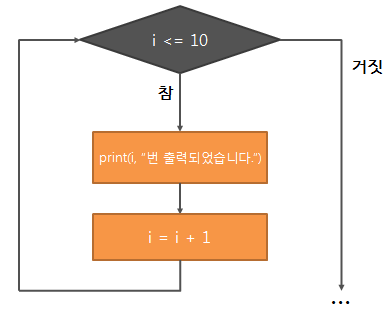

# 함수 흐름제어 2

반복문 / break, continue / 리스트 컴프리헨션

---

# GOAL
1. 반복문 개념
2. for문 상세
3. while문 상세
4. break / continue
5. 리스트 컴프리헨션
6. 내장 함수 (range, enumerate)
7. 복잡한 조건문 & 반복문

---

# 반복문이란?


---
# 반복문이란?

- 같은 코드를 여러 번 실행하는 도구
- **반복 작업을 자동화**할 수 있음
- 예: 10명의 학생 이름 출력하기

---

# 반복문 종류
- **for문**: 정해진 횟수, 시퀀스 순회
- **while문**: 조건이 True일 동안 반복

---

# 2. for문


---
# 2. for문

```python
for name in ["철수", "영희", "민수"]:
    print("안녕,", name)
```
출력
```
안녕, 철수
안녕, 영희
안녕, 민수
```

---

# for문 내부 동작
리스트 = ["철수", "영희", "민수"]

```
1회전: name = "철수"
2회전: name = "영희"
3회전: name = "민수"
```

- 각 요소가 차례대로 변수에 들어감

---
# 이터러블(Iterable)이란?
- **하나씩 꺼낼 수 있는 객체**
- 내부적으로 `__iter__()` 메서드를 가짐
- for문 `in` 뒤에는 반드시 이터러블이 와야 함

-  “줄을 서서 한 명씩 꺼낼 수 있는 자료 구조”

---

# 3. 이터러블 종류
- 문자열 (str)
- 리스트 (list)
- 튜플 (tuple)
- 딕셔너리 (dict → key 기준 순회)
- 집합 (set)
- range 객체

---

# 문자열 iterable
```python
for ch in "Python":
    print(ch)
```
출력:
```
P
y
t
h
o
n
```

---

# list iterable
```python
for fruit in ["사과","바나나","체리"]:
    print(fruit)
```
출력:
```
사과
바나나
체리
```

---

# tuple iterable
```python
for item in (1,2,3):
    print(item)
```
출력:
```
1
2
3
```

---

# dict iterable
```python
person = {"name":"철수", "age":20}
for key in person:
    print(key, ":", person[key])
```
출력:
```
name : 철수
age : 20
```

---

# set iterable
```python
for num in {10,20,30}:
    print(num)
```
출력 (순서는 일정치 않음):
```
10
20
30
```

---

# range() iterable
```python
for i in range(3):
    print(i)
```
출력:
```
0
1
2
```
- 번호표를 하나씩 꺼내주는 느낌
---

# enumerate() iterable
- (인덱스, 값) 쌍을 차례대로 반환
- 반복문에서 번호와 값을 동시에 써야 할 때 가장 깔끔한 방법
```python
names = ["Kim","Lee","Park"]
for i, name in enumerate(names, start=1):
    print(i, name)
```
출력
```
1 Kim
2 Lee
3 Park
```
---
# zip() iterable
```py
names = ["철수", "영희", "민수"]
scores = [85, 92, 78]

for name, score in zip(names, scores):
    print(name, ":", score)

# 철수 : 85
# 영희 : 92
# 민수 : 78
```
---
# zip() iterable
```py
names = ["철수", "영희"]
scores = [90, 80, 70]  # 더 길다

for n, s in zip(names, scores):
    print(n, ":", s)

# 철수 : 90
# 영희 : 80
```

---

# 중첩 for문 (구구단)
```python
for i in range(2, 5):
    for j in range(1, 4):
        print(i, "x", j, "=", i*j)
```
---
# 4. while문 기본
```python
x = 3
while x > 0:
    print("카운트:", x)
    x -= 1
```
출력
```
카운트: 3
카운트: 2
카운트: 1
```

---

# while문 종료 조건
- 조건이 False가 되면 종료
- 조건이 영원히 True면 무한 루프

```python
while True:
    break
```

---

# while문 예시
잔액이 0이 될 때까지 반복

```python
money = 3000
while money > 0:
    print("음료 구매")
    money -= 1000
```

출력: 3번만 실행

---

# 5. break
- 반복문을 즉시 종료

```python
for i in range(1, 10):
    if i == 5:
        print("5에서 멈춤!")
        break
    print(i)

# 1
# 2
# 3
# 4
# 5에서 멈춤!

```

출력: 1 2 3 4

---
# 5. break

```py
x = 1
while True:
    if x > 3:
        break
    print(x)
    x += 1
# 1
# 2
# 3
```

---

# 6. continue
- 현재 회차 건너뛰기

```python
for i in range(1, 6):
    if i % 2 == 0:
        continue
    print(i)
# 1
# 3
# 5
```
---

# 6. continue
```py
x = 0
while x < 5:
    x += 1
    if x % 2 == 0:
        continue
    print(x)
# 1
# 3
# 5
```
---
# break & continue 차이
- break 👉 회의 자체 종료
- continue 👉 특정 안건만 건너뜀

---

# 7. 리스트 컴프리헨션
```python
squares = [x**2 for x in range(1,6)]
print(squares)

# [1,4,9,16,25]
```
- [표현식 for 변수 in iterable] 구조로 이루어짐.
---

# 리스트 컴프리헨션 조건 포함
```python
evens = [x for x in range(10) if x%2==0]
print(evens)

# [0,2,4,6,8]
```
- 뒤쪽에 if 조건을 붙여 필터링 가능.

---

# 중첩 for문

```py
gugudan = [f"{i}x{j}={i*j}" for i in range(2,10) for j in range(1,10)]
print(gugudan[:10]) 

# ['2x1=2', '2x2=4', '2x3=6', ..., '2x9=18', '3x1=3', ...]
```

---
# 문자열 처리
```py
text = "hello"
upper_chars = [ch.upper() for ch in text]
print(upper_chars)  # ['H','E','L','L','O']
```
---
# 실용 예제

```py
patients = [
    {"name":"철수","age":25},
    {"name":"영희","age":30},
    {"name":"민수","age":17},
]

# 성인 환자 이름만 추출
adults = [p["name"] for p in patients if p["age"] >= 20]
print(adults)  # ['철수','영희']

```

---

# dict/ set comprehension

```py
# dict
squares = {x: x**2 for x in range(5)}
print(squares)  # {0:0,1:1,2:4,3:9,4:16}

# set
evens = {x for x in range(10) if x%2==0}
print(evens)  # {0,2,4,6,8}
```
---
# 실습: 환자 정보 관리 콘솔
1. 환자 정보 입력 → dict 만들어 리스트에 추가

2. 환자 목록 보기 → for와 enumerate(start=1)로 순번과 함께 출력

3. 이름으로 검색 (부분 일치) → for + 조건

4. 환자 정보 수정 (메모만 간단히) → 선택한 환자의 memo 업데이트

5. 환자 삭제 → 선택한 번호의 환자 제거
---
# 실습: 환자 정보 관리 콘솔

6. 간단 통계
-  총 환자 수 (len)
-  평균 나이 (sum / len, 환자 없으면 0)

- 성별 분포 (count)

7. 데이터 초기화

8. 종료 → break