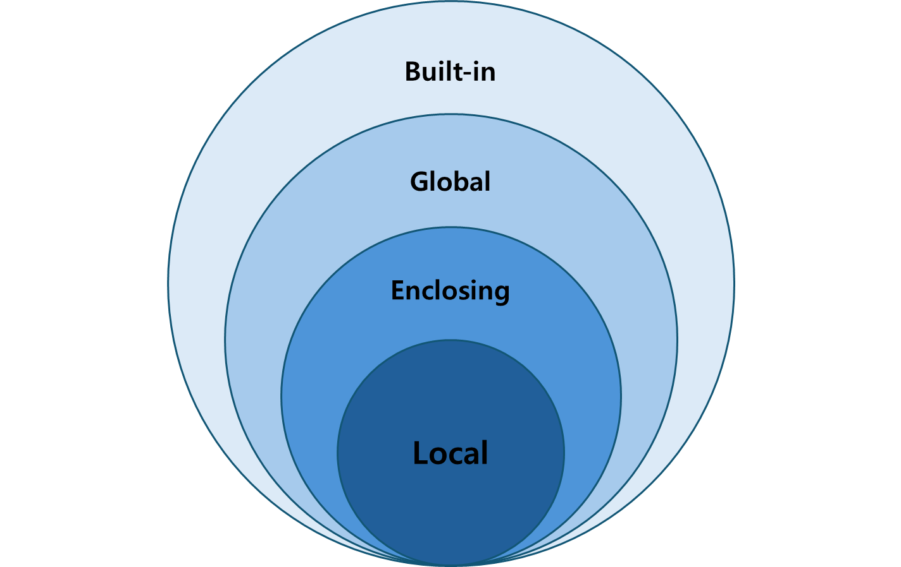

# Python 스코프와 모듈/패키지


# GOAL
- 지역변수 vs 전역변수 이해하기
- 스코프(LEGB)와 렉시컬 스코핑
- 메모리 동작 (스택, 힙)
- 모듈과 패키지 사용법
- 리스트 컴프리헨션 변수 스코프
- pip 패키지 배포 개념 알기

# 변수란?
- 데이터를 저장하는 **이름표**
- 변수는 "어디서 보이고, 언제까지 살아남는가?" → **스코프**


# 지역변수(Local Variable)
- 함수 안에서만 살아있음
- 함수 실행이 끝나면 사라짐

```python
def test():
    a = 10
    print(a)

test()
print(a)  # ❌ 오류
```

# 전역변수(Global Variable)
- 프로그램 전체에서 사용 가능
```python
b = 100

def show():
    print(b)

show()
print(b)  # 100
```


# 전역변수 수정하기
- `global` 키워드 필요

```python
count = 0

def inc():
    global count
    count += 1

inc()
print(count)  # 1
```


# 스코프 탐색 규칙 (LEGB Rule)


# 스코프 탐색 규칙 (LEGB Rule)

1. Local (지역)
2. Enclosed (중첩 함수)
3. Global (전역)
4. Built-in (내장)

# Local
- 현재 실행 중인 함수 안에서 정의된 변수
- 가장 먼저 확인하는 영역
```python
def inner():
    x = "local"
    print(x)   # local
```

# Enclosed
- 내부 함수에서 변수를 찾을 때, 바로 바깥 함수의 변수도 확인
- 중첩 함수(closure)에서 사용되는 개념
```python
def outer():
    x = "enclosed"
    def inner():
        print(x)
    inner()

outer()
```

# Global
- 파일 전체에서 접근 가능한 영역
- 함수 밖에서 정의된 변수
```python
x = "global"

def func():
    print(x)

func()
print(x)
```

# Built-in
- 파이썬이 기본 제공하는 예약어, 함수, 예외 등이 있는 영역
- print(), len(), range() 같은 것들
```python
print(len([1,2,3]))
print(abs(-5))
```

# 렉시컬 스코핑(Lexical Scoping)
- 변수를 찾는 기준 = 코드가 정의된 위치
- 정의된 위치(코드 구조) 를 기준으로 스코프를 찾음
- 파이썬, 자바스크립트(ES6+), C, 자바 등 대부분의 현대 언어가 사용
```python
x = 10
def outer():
    x = 20
    def inner():
        print(x)   # 정의된 위치 기준 → outer의 x 사용
    return inner

f = outer()
f()  # 결과: 20
```
# 동적 스코핑 (Dynamic Scoping)

호출 시점의 스택(Call Stack) 을 기준으로 스코프를 찾음

일부 옛날 언어(Lisp 초기 버전, Emacs Lisp 일부 설정 등)에서 사용
# 동적 스코핑 (파이썬은 지원x)
```py
# 파이썬에서 지원 된다는 가정
x = 10

def outer():
    x = 20
    return inner   # inner를 반환하지만 inner 정의는 밖에 있음

def inner():
    print(x)  # 렉시컬 스코핑이면 전역 x 참조

outer()
```
렉시컬 스코핑(Python): 결과 → 10 (inner는 전역에서 정의됨 → 전역 x 참조)

동적 스코핑(가정): 결과 → 20 (outer가 호출된 스택에서 x=20을 찾음)

# nonlocal 키워드
- 함수 안에서 변수를 쓸 때, 기본적으로는 지역 변수(Local) 로 인식
- 중첩 함수(내부 함수) 안에서, 바깥 함수(Enclosed scope) 의 변수를 수정하고 싶을 때 nonlocal을 사용
# nonlocal 없을 때
```python
def outer():
    x = 10
    def inner():
        x = 20  # 새로운 지역 변수 x를 만들어버림
        print("inner:", x)
    inner()
    print("outer:", x)

outer()
# inner: 20
# outer: 10
```
# nonlocal 사용
```py
def outer():
    x = 10
    def inner():
        nonlocal x   # 바깥(Enclosed) x를 사용
        x = 20
        print("inner:", x)
    inner()
    print("outer:", x)

outer()
# inner: 20
# outer: 20
```

# global vs local
```python
x = 5

def foo():
    global x
    x = 99

foo()
print(x)  # 99
```

# 전역변수의 문제점
- 편하지만 위험
- 충돌 가능성
- 함수/클래스 내부 관리 권장

# Python 함수 호출과 Call stack
- 파이썬 인터프리터는 위에서부터 한 줄씩 읽고 실행
- 코드가 실행되면, 프레임(Frame) 이라는 실행 단위가 콜 스택(Call Stack) 에 쌓임
- 각 함수 호출마다 새로운 프레임이 생김
- 프레임에는 지역변수, 인자, 반환 주소, 스코프 정보(LEGB) 등이 저장됨

# 스택 프레임
```py
def outer():
    x = 10
    def inner():
        y = 20
        print(x + y)
    inner()

outer()
```
---
```sql
처음 시작
┌───────────────┐
│   Global      │ ← 전역 변수, 함수 정의
└───────────────┘

outer() 호출
┌───────────────┐
│   outer       │ ← 지역 변수 x=10
├───────────────┤
│   Global      │
└───────────────┘

inner() 호출
┌───────────────┐
│   inner       │ ← 지역 변수 y=20
├───────────────┤
│   outer       │ ← 지역 변수 x=10
├───────────────┤
│   Global      │
└───────────────┘

inner 종료 → pop
┌───────────────┐
│   outer       │ ← 지역 변수 x=10
├───────────────┤
│   Global      │
└───────────────┘

outer 종료 → pop
┌───────────────┐
│   Global      │
└───────────────┘

프로그램 종료 → Global도 해제
(빈 스택)

```


# 모듈이란?
- 모듈(module) = 파이썬 코드가 들어 있는 .py 파일 하나

- 기능별로 코드를 잘라서 저장해두고, 다른 코드에서 가져다 쓰는 "부품" 역할

```python
import math
print(math.sqrt(16))
```

# 커스텀 모듈
```python
# calc_module.py
def add(a, b):
    return a + b

def subtract(a, b):
    return a - b
```
```python
import calc_module

print(calc_module.add(10, 5))      # 15
print(calc_module.subtract(10, 5)) # 5
```

# from import
```python
from my_calculator import add, subtract

print(add(20, 5))       # 25
print(subtract(20, 5))  # 15
```

# 별칭 사용하기(alias)
- Python에서 자주 쓰이는 라이브러리(import) 들은 보통 긴 이름을 줄여서 별칭(alias) 으로 사용
```python
# 데이터 처리 모듈
import numpy as np      # NumPy → np
import pandas as pd     # pandas → pd
import polars as pl     # Polars → pl (pandas 대체 라이브러리)
# 데이터 시각화 모듈
import matplotlib.pyplot as plt  # matplotlib → plt
import seaborn as sns           # seaborn → sns
# 머신러닝 & AI 모듈
import tensorflow as tf    # TensorFlow → tf
import torch as th         # PyTorch (보통은 torch 그대로, th 쓰는 경우도 있음)
import torch.nn as nn      # 신경망 모듈 → nn
```

# 패키지란?
- 여러 모듈(.py 파일)을 묶어둔 폴더
- 파이썬에서 큰 프로젝트를 구조적으로 관리할 때 사용
# 패키지 구조
```
myproject/
    math_tools/          ← 패키지(폴더)
        __init__.py      ← 패키지임을 표시 (Python 3.3 이상은 없어도 패키지 취급)
        add.py           ← 모듈
        subtract.py      ← 모듈
    main.py

```
```py
# add.py
def add(a, b):
    return a + b
```

```py
# subtract.py
def subtract(a, b):
    return a - b

```

# 패키지 사용
```python
from math_tools import add, subtract

print(add.add(3, 2))       # 5
print(subtract.subtract(3, 2))  # 1
```

# __init__.py
- 원래는 폴더가 패키지임을 표시하는 파일 (예전 Python 필수, 3.3 이후엔 생략 가능)

- 지금은 없어도 패키지로 인식하지만, 보통은 초기화 코드나 패키지의 공개 API 정리용으로 둠

```py
# math_tools/__init__.py
from .add import add
from .subtract import subtract
```

```py
# __init__.py 덕분에 더 짧게 사용 가능
from math_tools import add, subtract
print(add(10, 5))  # 15
```
# 내장 모듈
```python
import os          # 운영체제 기능 (경로, 환경변수 등)
import sys         # 파이썬 인터프리터 관련 (버전, argv, 경로 등)
import pathlib     # 객체지향적으로 파일/폴더 경로 다루기
import shutil      # 파일 복사/이동/삭제
import datetime    # 날짜/시간 다루기
import time        # 시간 측정, sleep
import calendar    # 달력, 요일 계산
import math        # 수학 함수 (sqrt, sin, cos, pi 등)
import random      # 난수 생성 (choice, shuffle, randint)
```

# 외부 패키지 설치
```bash
pip install requests
```
```python
import requests
res = requests.get("https://example.com")
print(res.status_code)
```

# requirements.txt
```
requests==2.31.0
pandas>=2.0
```
```bash
pip install -r requirements.txt
```

# 실습
BMI 측정 유틸 모듈 및 패키지 만들기
- BMI 공식: BMI = 체중(kg) / (신장(m))^2
- 입력 단위: 신장은 cm, 체중은 kg만 사용

- 저체중: < 18.5
- 정상: 18.5 ~ 22.9
- 과체중: 23.0 ~ 24.9
- 비만 : 25.0 ~
---
- 모듈 구조 요구 사항
```
bmi-module/
├─ main.py          # main 실행: input 받기 + 출력
└─ bmi_utils.py    # calc_bmi, classify_bmi 구현
```

- 패키지 구조
```
bmi-package/
├─ main.py              # main 실행: input 받기 + 출력
└─ bmi_utils/
   ├─ __init__.py      # 외부 공개 API
   ├─ calculators.py   # calc_bmi
   └─ classifiers.py   # classify_bmi
```