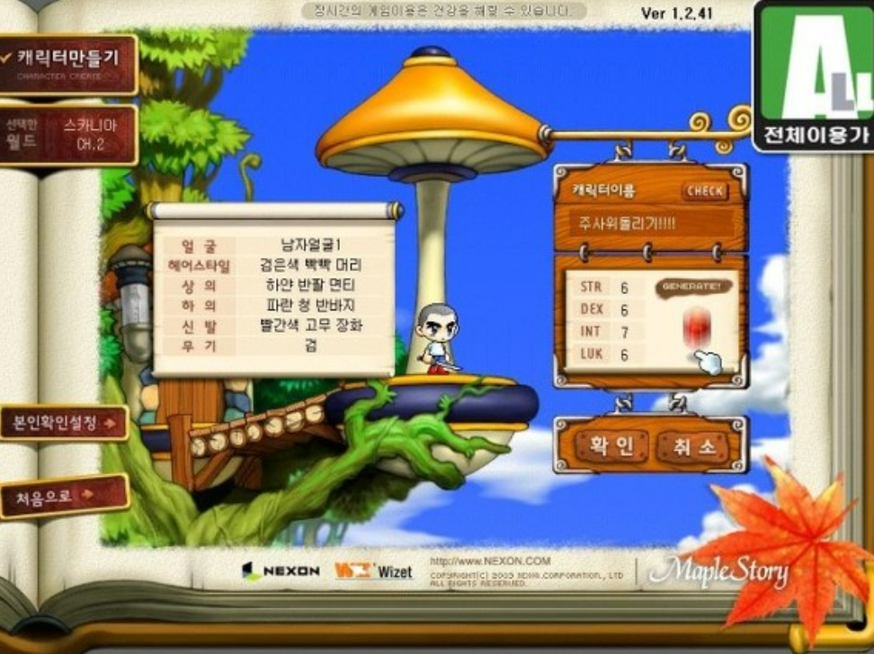

# Python 객체지향프로그래밍(1)

---

## GOAL
- 데코레이터에 대한 이해
- 클래스(Class)와 객체(Object) 개념 이해  
- `__init__`, `self`의 역할 알기
- 인스턴스 변수와 클래스 변수의 차이  
- 접근제어 및 캡슐화
---
# 데코레이터란?
- 함수나 메서드에 기능을 덧입히는 도구
- 추가 동작(로깅, 권한검사, 실행시간 측정 등) 을 넣는 기능
---

# 함수 내부에 직접 로그를 넣으면
```py
def greet():
    print("[LOG] 함수 시작")
    print("안녕하세요!")
    print("[LOG] 함수 끝")
```
→ 모든 함수마다 이렇게 넣어야 한다면? (중복 + 유지보수 어려움)

---
# 데코레이터 사용
```py
def log_decorator(func):
    def wrapper():
        print("[LOG] 함수 시작")
        func()
        print("[LOG] 함수 끝")
    return wrapper

@log_decorator
def greet():
    print("안녕하세요!")

```
- 함수이름 = decorator(함수이름)
- 데코레이터는 함수를 받아서 새로운 함수를 반환하는 함수
---

# 클래스가 왜 필요할까?


---

## 중복된 코드의 문제

```python
name1 = "루카"
level1 = 1
job1 = "초보자"

name2 = "메르세데스"
level2 = 1
job2 = "초보자"
```

- 캐릭터를 100개 만들면? → 변수 300개… 😨  
- “캐릭터라는 개념”을 하나로 묶고 싶다 → **클래스 등장!**

---

# 클래스란?
- 객체를 만들기 위한 설계도
- 안에는 변수(속성)와 함수(기능)를 정의할 수 있음

---

## 클래스 = 설계도

- **클래스(Class)** : 캐릭터 설계도  
- **객체(Object)** : 설계도로 찍어낸 캐릭터

```python
class Character:
    pass
```

```python
hero = Character()  # 인스턴스(객체) 생성
```

---

## 비유

| 개념 | 캐릭터 비유 |
|------|-------------|
| 클래스 | 캐릭터 생성 화면의 설계도 |
| 객체(인스턴스) | 실제 게임 속 내 캐릭터 |
| 인스턴스 변수 | HP, MP, STR 같은 능력치 |

---


---
# __init__ 생성자
- 객체가 만들어질 때 자동으로 실행되는 초기 설정 함수
- 보통 초기값을 정하는 용도
- 클래스를 함수처럼 쓸 수 있음
---

## 캐릭터가 만들어질 때 자동 실행

```python
class Character:
    def __init__(self, name, job="초보자"):
        self.name = name
        self.job = job
        self.level = 1
        self.hp = 100
        print(f"{self.name}님({self.job}) 생성 완료!")
```

```python
c1 = Character("루카")
c2 = Character("메르세데스")
```

---

## self란?

- “**나 자신**”을 가리키는 키워드  
- 각 캐릭터마다 **자신만의 HP, MP**를 저장

```python
class Character:
    def __init__(self, name):
        self.name = name

c1 = Character("루카")
c2 = Character("메르세데스")
print(c1.name)  # 루카
print(c2.name)  # 메르세데스
```

---

# 인스턴스 변수 (Instance Variable)

- self.변수명 으로 선언
- 각 객체마다 독립적으로 존재
- 주로 __init__() 안에서 정의함
---

# 클래스 변수 (Class Variable)

- 클래스 전체가 공유하는 값
- 클래스 안에서 self 없이 선언
- 인스턴스보다는 “클래스 자체”에 속함

---

```python
class Character:
    job = "초보자"  # 클래스 변수 (공통)
    def __init__(self, name):
        self.name = name   # 인스턴스 변수 (개별)
```

```python
a = Character("유저1")
b = Character("메르세데스")
Character.job = "초보자(리뉴얼)"

print(a.job, b.job)  # 둘 다 바뀜
print(a.name)        # 유저1 (개별 보존)
```

---
# 함수

```python
def attack(name):
    print(f"{name}이(가) 공격했다!")
```
---

# 메서드

- 함수는 “독립적”  
- 메서드는 “클래스 안에 존재”

---
# 인스턴스 메서드
- 각 캐릭터가 개별 행동할 때 사용
- self를 통해 인스턴스 변수와 클래스 변수에 모두 접근 가능


```python
class Character:
    def attack(self):
        print(f"{self.name}이(가) 공격했다!")
```

```python
hero = Character("유저1")
hero.attack()
```

---

# 클래스 메서드 (@classmethod)

- cls를 통해 클래스 변수만 접근 가능
- 전체 서버나 캐릭터 통계처럼 공용 데이터를 다룰 때 사용
```py
class Character:
    total_characters = 0

    def __init__(self, name):
        self.name = name
        Character.total_characters += 1

    @classmethod
    def show_total(cls):
        print(f"현재 생성된 캐릭터 수: {cls.total_characters}")

a = Character("아란")
b = Character("루미너스")
Character.show_total()
```
---

# 정적 메서드 (@staticmethod)

- self, cls 둘 다 없음
- 인스턴스나 클래스 상태에 관계없이 독립적인 유틸 기능 제공

```py
import random

class Character:
    @staticmethod
    def roll_dice():
        print("주사위를 굴린다...")
        return random.randint(1, 6)

result = Character.roll_dice()
print("결과:", result)
```
---
# 접근제어
- 클래스 내부의 변수나 메서드에 외부에서 접근할 수 있는 범위를 조절하는 것
- 데이터를 보호하고, 외부에서 직접 수정하는 걸 막기
---
| 구분                 | 표기법                 | 의미                                | 외부 접근     | 예시             |
| ------------------ | ------------------- | --------------------------------- | --------- | -------------- |
| **Public (공개)**    | 일반 이름 (`self.name`) | 누구나 접근 가능                         |  가능      | `player.name`  |
| **Protected (보호)** | `_변수명` (한 개의 밑줄)    | 내부 사용 권장, 외부에서도 접근은 가능하지만 “비추천”   | 가능 | `player._hp`   |
| **Private (비공개)**  | `__변수명` (두 개의 밑줄)   | 내부에서만 접근 가능 (이름이 바뀜, 외부 직접 접근 불가) | 불가능     | `player.__exp` |
---

# 접근제어 예제

```py
class Character:
    def __init__(self, name):
        self.name = name        # Public (공개)
        self._hp = 100          # Protected (보호)
        self.__exp = 0          # Private (비공개)

player = Character("유저1")

print(player.name)   # ✅ 가능
print(player._hp)    # ⚠️ 접근 가능하지만 비추천
print(player.__exp)  # ❌ 에러! (private 접근 불가)
```

---
# 캡슐화(Encapsulation)란?

- 객체의 데이터(속성) 와 행동(메서드) 를 하나로 묶음
- 외부에서 직접 접근하지 못하게 보호
- 데이터는 숨기고, 메서드를 통해서만 조작하도록 만듦
---

# 캡슐화가 왜 필요할까?

- 외부에서 캐릭터의 HP나 EXP를 직접 수정하면 오류가 생길 수 있음
- 내부 속성(__hp, __exp, __gold 등)은 비공개(private)
- 메서드(get/set) 를 통해서만 접근할 수 있어야 함
---
# 캡슐화 없이 접근
```py
class Character:
    def __init__(self, name):
        self.name = name
        self.hp = 100

player = Character("아란")

player.hp = -9999
print(player.hp)  # -9999
```
---
# Getter / Setter
- 데이터를 보호하고, 안전하게 다루기 위해
- 검증 로직 추가 가능
- 캡슐화 유지
- 유연한 수정 기능

---
```py
class Character:
    def __init__(self, name):
        self.name = name
        self.__hp = 100   # private 변수
        self.__exp = 0

    def get_hp(self):
        return self.__hp

    def set_hp(self, value):
        if value < 0:
            print("❌ HP는 음수가 될 수 없습니다!")
        else:
            self.__hp = value
```

---

# 프로퍼티(@property)
- 메서드를 변수처럼 보이게 만들어주는 기능
- @property 데코레이터를 이용해 get_hp 메서드 구현
- 캡슐화
---
```py
class Character:
    def __init__(self, name):
        self.__hp = 100
        self.name = name

    @property
    def hp(self):
        return self.__hp

    @hp.setter
    def hp(self, value):
        if value < 0:
            print("❌ HP는 0보다 작을 수 없습니다!")
        else:
            self.__hp = value
```
---


# 실습 
- 메이플스토리 캐릭터 생성

| 구분    | 기능        | 설명                                 |
| ----- | ---------- | ---------------------------------- |
| **1** | 캐릭터 생성     | 사용자가 이름을 입력하고, 주사위를 굴려 능력치를 결정함    |
| **2** | 이름 중복 방지   | 이미 생성된 캐릭터 이름이 존재하면 새 이름을 요청함      |
| **3** | 주사위 능력치 생성 | STR, DEX, INT, LUK 각각 4~8 범위의 랜덤 값 |
| **4** | 능력치 재굴리기   | 생성 전 `y/n` 입력으로 재시도 가능             |
| **5** | 캐릭터 등록     | 생성 완료 시 리스트(`characters`)에 저장      |
| **6** | 캐릭터 목록 보기  | 지금까지 만든 캐릭터 이름 및 능력치를 출력           |
| **7** | 종료         | 프로그램을 종료 (while 루프 종료)             |
