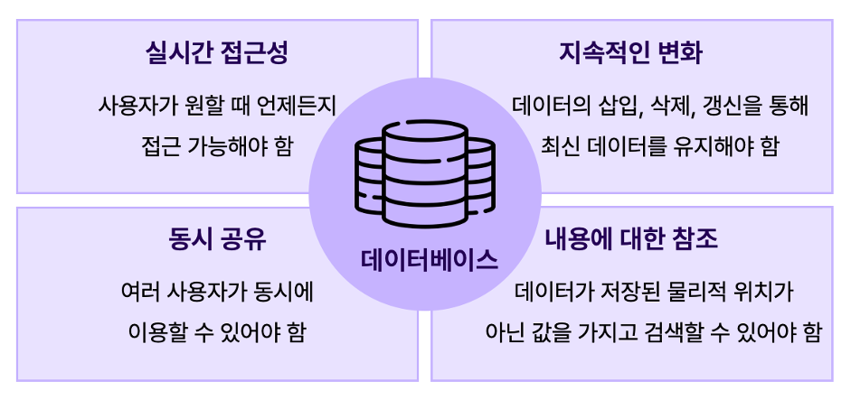
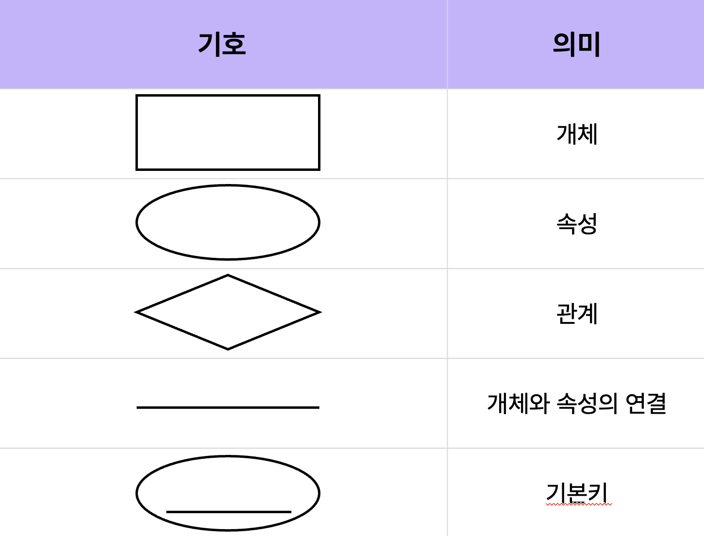

# 헬스케어와 데이터베이스 & ERD 실습

> 현실의 의료 데이터를 데이터베이스로 옮겨보자!
---
# GOAL

현실 세계의 의료 데이터를 **논리적 구조(ERD)**로 표현할 수 있다  
**개체(Entity), 속성(Attribute), 관계(Relationship)**의 개념을 구분할 수 있다  
환자–의사–예약 테이블을 기반으로 **1:N 관계형 구조를 설계**할 수 있다

---
# 목차 (Table of Contents)

- 데이터 모델링 이해하기  
- 의료 데이터에서의 개체(Entity) 찾기  
- 속성(Attribute)과 관계(Relationship) 정의하기  
- ERD 표기법과 관계 유형  
- 환자-의사-예약 ERD 실습  
---
# 데이터 엔지니어링이란?

데이터를 **수집 → 저장 → 처리 → 분석**하기 위해  
데이터 흐름(파이프라인)을 설계하고 관리하는 분야

데이터 엔지니어는 데이터를  
👉 **“어디서 왔는지”**,  
👉 **“어떻게 저장할지”**,  
👉 **“어떻게 효율적으로 꺼내 쓸지”**  
를 설계하는 사람입니다.

---

# 데이터를 저장하는 여러 방법

| 구분 | 예시 | 설명 |
|------|------|------|
| **로컬 파일** | 엑셀, CSV | 정형화된 표 형태로 데이터를 저장 |
| **RDBMS** | MySQL, PostgreSQL | SQL 기반, 테이블 간 관계로 데이터를 관리 |
| **NoSQL** | MongoDB, Redis | 문서형/키-값 등 비정형 데이터 처리 |
| **Data Warehouse** | BigQuery, Snowflake | 대용량 데이터 분석용 시스템 |
| **Data Lake** | AWS S3, Hadoop | 다양한 형식의 원시 데이터를 저장 |
---
# 헬스케어·의료 데이터의 특징
## 1. 정형데이터 + 비정형데이터가 공존

### 정형데이터: 숫자나 표로 정리된 것
→ 예: 환자 ID, 혈압, 혈당, BMI, 진료 날짜 등

### 비정형데이터: 형식이 일정하지 않은 데이터
→ 예: 엑스레이 이미지, MRI, 의사 소견서, 음성 기록 등

- 의료 데이터베이스는 이 두 가지를 모두 저장할 수 있어야 합니다.

---
## 2. 보안과 개인정보 보호가 최우선

### 환자 정보는 식별 가능한 민감 데이터
→ 이름, 주민번호, 진단기록, 유전자정보 등

- 그래서 암호화, 접근권한, 로그 기록, 익명화가 필수!
의료법, 개인정보보호법, HIPAA(해외) 등 법적 규제를 따라야 함


>병원 데이터베이스는 아무나 볼 수 없어야 함
문 열쇠(접근권한)는 의사와 연구자에게만 줘야 함

---

## 3. 정확성과 일관성이 매우 중요 (무결성)

- 진료기록 하나의 오타나 중복이 생명에 영향을 줄 수 있음
- 그래서 관계형 DB(RDB) 를 주로 사용
  - 환자(patient), 진료(record), 처방(prescription) 테이블로 나눠서
“관계(Foreign Key)”로 연결

- 데이터가 꼬이지 않도록 보장해야 함

---
## 4. 대용량 + 장기 저장 필요

- 의료 데이터는 보통 평생 보관
→ 예: 10년 전 진료기록, 5년 전 MRI 영상도 다시 확인

- 병원마다 수십만 명의 환자, 수백 GB~TB 단위

- 확장성 있는 클라우드 + 분산 저장 시스템이 필요
---

## 5. 분석과 인공지능(AI) 학습용으로 활용
- 진단 자동화, 질병 예측, 맞춤형 치료 등에 사용

- 단, AI 학습 전에는 반드시 익명화(De-identification) 필요

- 의료 AI 학습용 DB는 일반 상업용 DB보다
“데이터 품질 + 표준화”가 훨씬 중요
---

# 엑셀도 데이터베이스?
**공통점**  
- 데이터를 표(Table) 형태로 저장  
- 행(Row)과 열(Column)로 구성  

**차이점**  
- 엑셀은 **한 사람이 직접 수정**하는 작은 데이터 저장 도구  
- DB는 **여러 사용자가 동시에 접근하고 관리**할 수 있는 시스템  

엑셀은 “작은 개인용 데이터베이스”,  
RDBMS는 “기업용 데이터베이스”라고 생각하면 쉽다!

---

# 데이터 저장의 진화

```plaintext
엑셀 / CSV → RDBMS (MySQL, PostgreSQL)
          → NoSQL (MongoDB, Redis)
          → Data Warehouse / Lake (BigQuery, S3)
```
- 엑셀/CSV: 파일 단위 저장
- RDBMS: 구조화된 관계형 저장
- NoSQL: 유연한 문서/그래프/키값 저장
- DW / DL: 대용량 분석 및 통합 저장소

💡 데이터 엔지니어링은
이 모든 저장소를 연결하고 데이터를 흐르게 만드는 기술!

---
# 데이터베이스 개요

**데이터(Data)**: 현실 세계에서 수집된 단순한 사실과 값들을 모아 놓은 것
**정보(Information)**: 데이터를 특정 목적에 의해 해석하거나 가공한 형태

예: ‘10월 매출 1,000만 원’ (데이터) → ‘작년 대비 20% 증가’ (정보)

---

# 데이터베이스 개요



---

# 데이터들의 집합

> “한 조직 안에서 여러 사용자와 응용 프로그램이 **공동으로 사용하는 데이터**를 **통합하여 저장하고 운영**하는 데이터”

즉, 데이터베이스는 **데이터를 모아 효율적으로 관리하는 시스템**

---

# 파일처리 시스템의 한계

* 데이터 구조가 바뀌면 응용 프로그램도 바꿔야 함 → **데이터 종속 문제**
* 프로그램마다 데이터를 따로 만들어서 중복 발생 → **데이터 중복 문제**
* 데이터의 **무결성(Integrity)**을 유지하기 어려움

>  *무결성*: 데이터가 정확하고 일관된 형태로 유지되는 것 (Integrity)

---

# 데이터베이스 종류

| 종류                            | 설명                          |
| ----------------------------- | --------------------------- |
| **RDB (Relational Database)** | 관계형 모델 기반으로 SQL을 이용해 데이터 관리 |
| **NoSQL (Not Only SQL)**      | 데이터 간 관계를 정의하지 않고 유연한 구조 사용 |

**RDB 예시:** MySQL, PostgreSQL, MariaDB
**NoSQL 예시:** MongoDB, Redis, Firebase

---

# 관계형 데이터베이스 (RDB)

* 데이터를 **행(Row)**과 **열(Column)** 형태의 **테이블(Table)**로 표현
* 테이블 간의 관계를 이용해 효율적으로 관리 → **무결성 보장**
* **스키마(Schema)**에 맞는 데이터만 입력 가능 → 안정성 확보
* 구조가 일관적인 경우 사용

예: 은행 고객 정보, 쇼핑몰 상품 데이터 등

---

# NoSQL

* 저장할 데이터 유형에 제한이 없음
* 새로운 데이터 구조를 추가하기 쉬움
* 자주 변하는 데이터 구조에 적합
* 대용량 데이터 처리에 강함

예: SNS 피드, 로그 데이터, IoT 센서 데이터

---

# RDB vs NoSQL

## RDB

* 행과 열 구조의 테이블로 구성
* 관계 기반 모델 사용 → 일관성과 안정성 보장
* **데이터 무결성이 중요할 때** 사용
* 예: MySQL, PostgreSQL, MariaDB
---


---
## NoSQL

* 데이터 표현 방식이 유연하고 비정형적
* 대용량 데이터를 빠르게 처리
* **빅데이터, 실시간 로그, 캐시 처리** 등에 적합
* 예: MongoDB, Redis, Cassandra
---


---
 **언제 어떤 DB를 사용할까?**

* 구조가 명확하고 일관된 경우 → RDB
* 빠른 확장성과 유연성이 필요한 경우 → NoSQL

---

# 관계형 데이터베이스 구성 요소

| 구성 요소             | 설명                     |
| ----------------- | ---------------------- |
| **테이블(Table)**    | 행과 열로 구성된 데이터 저장 구조    |
| **속성(Attribute)** | 데이터의 특성을 나타내는 가장 작은 단위 |
| **튜플(Tuple)**     | 속성이 모여 구성된 하나의 행 (Row) |
| **도메인(Domain)**   | 속성이 가질 수 있는 값의 범위      |
---
| ID         | 이름  | 주소          |
| ---------- | --- | ----------- |
| tunalee    | 이동원 | 서울시 성북구 장위동 |
| chefkim     | 김은중 | 서울시 동작구 대방동 |
| dogowner | 김지수 | 서울시 관악구 신림동 |

속성(Attribute)은 Column, 튜플(Tuple)은 Row라고도 부른다!

---

# 관계 설정 예시

| ID         | 이름  | 주소          |
| ---------- | --- | ----------- |
| tunalee    | 이동원 | 서울시 성북구 장위동 |
| chefkim     | 김은중 | 서울시 동작구 대방동 |
| dogowner | 김지수 | 서울시 관악구 신림동 |

---

| ID         | 주문번호           |
| ---------- | -------------- |
| tunalee      | 4832-4921-7561 |
| chefkim    | 1987-9635-9985 |
| dogowner      | 5874-8782-9652 |
| freeman123 | 8226-9997-4123 |

**관계가 없다면** 주문번호와 함께 이름, 주소를 반복 저장해야 함
**관계가 있다면** ID 하나로 두 테이블을 연결하여 효율적으로 관리!


---
# 헬스케어 데이터와 관계형 모델의 연관성
### 의료 데이터는 ‘사람 중심의 관계형 구조’

- 환자 1명은 여러 번 병원을 방문할 수 있음 → 1:N 관계 (환자 - 진료기록)
- 한 번의 진료는 여러 개의 검사 결과를 가질 수 있음 → 1:N 관계 (진료 - 검사결과)
- 검사 결과에는 여러 의사가 참여할 수 있음 → N:M 관계 (검사 - 의사)

---
# 의료데이터의 무결성

- 환자 정보가 삭제되면 진료 기록도 같이 정리되어야 함 (참조 무결성)
- 동일한 환자가 중복 등록되지 않아야 함 (개체 무결성)
- 진단명, 약품 코드 등이 의료 표준 분류에 맞아야 함 (도메인 무결성)

> “환자 데이터의 무결성은 곧 의료의 신뢰성이다.”

---
# 키(Key)

## 조건에 만족하는 튜플을 찾거나, 정렬할 때 기준이 되는 속성
- 기본키
- 외래키
- 후보키
- 대체키
- 슈퍼키

---
# 기본키(Primary Key)
### 서로 다른 튜플을 유일하게 식별할 수 있는 기준이 되는 속성

- 중복되는 값을 가질 수 없음
- Null 값을 가질 수 없음
- 테이블 당 1개만 설정

| ID         | 이름  | 주소          |
| ---------- | --- | ----------- |
| tunalee    | 이동원 | 서울시 성북구 장위동 |
| chefkim     | 김은중 | 서울시 동작구 대방동 |
| dogowner | 김지수 | 서울시 관악구 신림동 |

---
# 외래키(Foreign Key)
### 다른 테이블의 기본키를 참조하는 속성으로 테이블의 관계를 정의

| ID         | 주문번호           |
| ---------- | -------------- |
| tunalee      | 4832-4921-7561 |
| chefkim    | 1987-9635-9985 |
| dogowner      | 5874-8782-9652 |
| freeman123 | 8226-9997-4123 |

---
# 그 외 키
- 후보키: 기본키가 될 수 있는 키로 유일성과 최소성을 만족 (기본키 ⊂ 후보키)
- 대체키: 후보키 중에 기본키가 아닌 키 (대체키 ⊂ 후보키)
- 슈퍼키: 튜플을 식별할 수 있는 유일성은 만족하지만 최소성*은 만족하지 않는 키

---

# 무결성 제약 조건

- 개체 무결성: 기본키는 Null 값과 중복된 값을 가질 수 없음
- 참조 무결성: 외래키는 Null이거나 참조되는 릴레이션의 기본키 값과 동일

- 도메인 무결성: 특정 속성값은 그 속성이 정의된 도메인에 속한 값이어야 함
- NULL 무결성: 특정 속성값은 널 값을 가질 수 없음
- 고유 무결성: 각 튜플이 가지는 속성값들은 서로 달라야 함
- 키 무결성: 테이블에 최소 한 개 이상의 키 존재
---
# 개체 무결성 (Entity Integrity)

> 기본키(Primary Key)는 비어 있으면 안 되고, 중복될 수 없음

| patient_id | name | age          |
| ---------- | ---- | ------------ |
| 101        | 김민준  | 30           |
| 102        | 이서연  | 28           |
| 102        | 박서준  | 35 ❌       |
| (NULL)     | 최유진  | 29 ❌ |

---

# 참조 무결성 (Referential Integrity)

> 외래키(Foreign Key)는 참조 대상의 기본키와 일치하거나 NULL이어야 함

| patient_id (PK) | name |
| --------------- | ---- |
| 101             | 김민준  |
| 102             | 이서연  |


| visit_id | patient_id (FK)    |
| -------- | ------------------ |
| v1       | 101               |
| v2       | 102               |
| v3       | 999 ❌ |

---

# 도메인 무결성 (Domain Integrity)

> 속성값은 정해진 범위(도메인) 안의 값이어야 함

| gender | age              |
| ------ | ---------------- |
| M      | 35               |
| F      | 28               |
| X      | 22 ❌  |
| M      | -5 ❌     |
---
# NULL 무결성 (NULL Integrity)
> 특정 속성은 널(비어 있음) 상태를 허용하지 않음

| patient_id | name | birth_date |
| ---------- | ---- | ---------- |
| 101        | 김민준  | 1994-08-10 |
| 102        | 이서연  | NULL ❌     |
---
# 고유 무결성 (Unique Integrity)

> 특정 속성(예: 이메일, 주민번호 등)은 중복될 수 없음

| patient_id | visit_date | department |
| ---------- | ---------- | ---------- |
| P001       | 2025-10-21 | 내과         |
| P001       | 2025-10-21 | 외과         |
| P001       | 2025-10-21 | 내과 ❌       |

---

# 키 무결성 (Key Integrity)

>테이블에는 최소 한 개 이상의 키(튜플을 구분할 기준)가 존재해야 함

| name | phone         |
| ---- | ------------- |
| 김민준  | 010-1111-2222 |
| 이서연  | 010-3333-4444 |

---
# 데이터 모델링

현실 세계에 존재하는 **환자, 의사, 처방, 검사** 등의 데이터를  
데이터베이스로 체계적으로 표현하는 과정

---
# 의료 데이터 예시 상황

환자가 병원에 방문하여 진료를 받고,  
의사가 진단 후 **처방**과 **검사**를 입력하는 과정

→ 이 모든 것은 현실의 행위이지만,  
**데이터 모델링을 통해 구조화된 데이터베이스로 표현**할 수 있음

---
#  데이터 모델의 구성 요소

현실 세계의 데이터를 단순화, 추상화하여 표현한 모델

| 구성요소 | 설명 | 의료 예시 |
|-----------|--------|-------------|
| **개체(Entity)** | 데이터로 표현할 대상을 의미 | 환자(Patient), 의사(Doctor), 진료(Visit), 처방(Prescription) |
| **속성(Attribute)** | 개체의 구체적 정보 | 환자의 이름, 생년월일, 진료일자, 약품명 |
| **관계(Relationship)** | 개체 간의 연관성 | 환자는 진료를 받는다 / 의사는 처방을 작성한다 |

---
# 데이터 모델링 단계

| 단계 | 설명 | 의료 데이터 예시 |
|------|------|----------------|
| **개념적 설계** | 현실 세계를 개념으로 표현 | “환자”, “진료”, “처방”을 개체로 정의 |
| **논리적 설계** | DBMS가 이해할 수 있는 구조 설계 | 테이블 간 관계(FK) 정의 |
| **물리적 설계** | 실제 저장 구조 설계 | PostgreSQL에서 각 테이블 생성 |
---
# ER 다이어그램 (ERD)

**Entity-Relationship Diagram (개체-관계 다이어그램)**  
→ 현실 세계의 데이터와 관계를 시각적으로 표현한 그림

> “환자가 병원에 방문해 진료받고, 진료 중 처방과 검사를 수행한다.”  
이 관계를 다이어그램으로 표현하면?


---
# ERD 표기 기호


---

# 관계의 종류

| 관계 | 설명 | 예시 |
|------|------|------|
| **1:1** | 한 환자가 하나의 진료기록만 갖는 경우 | (거의 드뭄) |
| **1:N** | 한 환자가 여러 번 진료 가능 |  환자–진료 |
| **N:M** | 여러 의사가 여러 환자를 진료 | (중간 테이블 ‘진료참여자’)로 표현 |

---


---
# 까마귀발 표기법


---
# 실습 (ERD 그려보기)

### 구조 설명:
- patients (환자): 환자의 기본 정보를 저장
- doctors (의사): 의사의 정보와 전문 분야를 저장
- appointments (예약): 환자와 의사를 연결하는 예약 정보를 저장

### 관계:
- 한 명의 환자는 여러 개의 예약을 가질 수 있습니다 (1:N)
- 한 명의 의사는 여러 개의 예약을 담당할 수 있습니다 (1:N)
- appointments 테이블이 patients와 doctors를 연결하는 중간 테이블 역할을 합니다