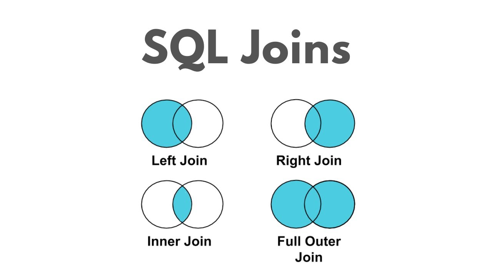

# 고급 SQL (조인·집계·서브쿼리·윈도우)

> 이전 CRUD 실습을 **분석 쿼리**로 확장!  
> 다중 테이블 JOIN, GROUP BY/HAVING, 서브쿼리를 단계적으로 익힘

---

## GOAL

- 다중 테이블 **JOIN (INNER/LEFT/RIGHT/FULL)** 이해 & 활용  
- **GROUP BY / HAVING** 집계와 조건  
- **서브쿼리**로 복잡한 문제 쪼개기

---
## 현실에서는 데이터가 한 곳에 다 들어있지 않음

문제 상황:
 의사 정보, 진료 기록이 각각 다른 테이블에 저장돼 있음

### 예약 
| doctor_id | name | specialty |
| --------- | ---- | --------- |
| 1         | 박지훈  | 외과        |
| 2         | 최가은  | 피부과       |
| 3         | 정우성  | 내과        |

---
### 의사
| appointment_id | patient_id | doctor_id | visit_date |
| -------------- | ---------- | --------- | ---------- |
| 1001           | 1          | 1         | 2025-10-22 |
| 1002           | 1          | 2         | 2025-10-23 |
| 1003           | 3          | 1         | 2025-10-24 |
| 1004           | 2          | 99        | 2025-10-25 |
---
### 환자

| patient_id | name | gender | visit_count | birth_date |
| ---------- | ---- | ------ | ----------- | ---------- |
| 1          | 이동원  | M      | 5           | 1993-01-01 |
| 2          | 김지수  | F      | 3           | 1995-12-31 |
| 3          | 신운서  | M      | 8           | 1997-02-14 |


---

## "진료 기록과 의사 정보를 알고 싶다”

→ 한 테이블만으로는 불가능
예를 들어 appointments에는 의사 ID만 있고, 이름이 없음


| appointment_id   | doctor_name | specialty | visit_date |
| --------------   | ----------- | --------- | ---------- |
| 1001           | 박지훈         | 외과        | 2025-10-22 |
| 1002                      | 최가은         | 피부과       | 2025-10-23 |
| 1003                      | 박지훈         | 외과       | 2025-10-24 |

---

## JOIN 개요

| 타입 | 설명 | 결과 |
|-----|-----|-----|
| **INNER JOIN** | 양쪽 모두 매칭되는 행만 | 교집합 |
| **LEFT JOIN** | 왼쪽 모두 + 매칭 | 왼쪽 기준 |
| **RIGHT JOIN** | 오른쪽 모두 + 매칭 | 오른쪽 기준 |
---


---
## AS 기본 개념
- AS는 SQL에서 컬럼명이나 테이블명에 ‘별칭(alias)’을 붙이는 키워드
```sql
SELECT 컬럼명 AS 별칭
FROM 테이블명 AS 별칭;
```
---

## INNER JOIN (내부 조인)

```sql
SELECT a.appointment_id, d.name AS doctor_name, d.specialty, a.visit_date
FROM appointments a
INNER JOIN doctors d ON a.doctor_id = d.doctor_id;
```
- 조건에 일치하는 행만 가져온다. (모두 매칭 된 데이터만 표시)
---
## INNER JOIN (내부 조인)

| appointment_id | doctor_name | specialty | visit_date |
| -------------- | ----------- | --------- | ---------- |
| 1001           | 박지훈         | 외과        | 2025-10-22 |
| 1002           | 최가은         | 피부과       | 2025-10-23 |
| 1003           | 박지훈         | 외과        | 2025-10-24 |

- 1004번 예약(doctor_id=99)은 doctors에 없으므로 제외
- 정우성(doctor_id=3)은 appointments에 없으므로 제외
---

## LEFT JOIN (왼쪽 우선)
>왼쪽(appointments)의 모든 데이터를 유지
오른쪽(doctor)에서 매칭 안 되면 NULL

```sql
SELECT a.appointment_id, p.name AS patient_name, d.name AS doctor_name, d.specialty, a.visit_date
FROM appointments a
LEFT JOIN doctors d ON a.doctor_id = d.doctor_id;
```
---
## LEFT JOIN (왼쪽 우선)

| appointment_id | doctor_name | specialty | visit_date |
| -------------- | ----------- | --------- | ---------- |
| 1001           | 박지훈         | 외과        | 2025-10-22 |
| 1002           | 최가은         | 피부과       | 2025-10-23 |
| 1003           | 박지훈         | 외과        | 2025-10-24 |
| 1004           | NULL        | NULL      | 2025-10-25 |

appointments는 전부 출력됨
→ doctor_id=99는 doctors에 없어서 NULL

---
## RIGHT JOIN (오른쪽 우선)

>오른쪽(doctors)의 모든 데이터를 유지
왼쪽(appointments)에서 매칭 안 되면 NULL

```sql
SELECT a.appointment_id, d.name AS doctor_name, d.specialty, a.visit_date
FROM appointments a
RIGHT JOIN doctors d ON a.doctor_id = d.doctor_id;
```
---
## RIGHT JOIN (오른쪽 우선)
| appointment_id | doctor_name | specialty | visit_date |
| -------------- | ----------- | --------- | ---------- |
| 1001           | 박지훈         | 외과        | 2025-10-22 |
| 1002           | 최가은         | 피부과       | 2025-10-23 |
| 1003           | 박지훈         | 외과        | 2025-10-24 |
| NULL           | 정우성         | 내과        | NULL       |

doctors는 전부 출력됨
→ 정우성(doctor_id=3)은 예약이 없으므로 appointment_id와 visit_date가 NULL

---
## JOIN 비교 요약
| JOIN 종류        | 기준 테이블            | 포함 범위          | 누락 시          |
| -------------- | ----------------- | -------------- | ------------- |
| **INNER JOIN** | 둘 다               | 조건 일치 행만       | 일치 안 하면 제외    |
| **LEFT JOIN**  | 왼쪽 (appointments) | 왼쪽 전부 + 오른쪽 매칭 | 오른쪽 없음 → NULL |
| **RIGHT JOIN** | 오른쪽 (doctors)     | 오른쪽 전부 + 왼쪽 매칭 | 왼쪽 없음 → NULL  |


---
## 집계 함수(Aggregate Function)란?

>여러 행(Row)을 하나의 통계값으로 요약하는 함수
예를 들어 “진료 건수”, “환자 수”, “평균 BMI”, “가장 최근 방문일” 등

---
## 주요 집계 함수
| 함수          | 설명       | 예시                 | 결과 예시        |
| ----------- | -------- | ------------------ | ------------ |
| **COUNT()** | 행의 개수 세기 | `COUNT(*)`         | 10 (행이 10개면) |
| **SUM()**   | 합계 계산    | `SUM(visit_count)` | 128          |
| **AVG()**   | 평균 계산    | `AVG(age)`         | 31.5         |
| **MAX()**   | 최댓값 찾기   | `MAX(bmi)`         | 33.2         |
| **MIN()**   | 최솟값 찾기   | `MIN(bmi)`         | 16.5         |

---
## COUNT()

> 진료 전체 건수
```sql
SELECT COUNT(*) AS total_appointments
FROM appointments;
```
| total_appointments |
| ------------------ |
| 4                  |
---
## COUNT(DISTINCT 컬럼명) — 중복 제거 후 개수
```sql
SELECT COUNT(DISTINCT doctor_id) AS unique_doctors
FROM appointments;
```
| unique_doctors |
| -------------- |
| 3              |

---
## MIN() / MAX() 
> 전체 진료 기록 중에서 첫 방문일과 마지막 방문일을 구함
```sql
SELECT MIN(visit_date) AS first_visit,
       MAX(visit_date) AS last_visit
FROM appointments;
```
| first_visit | last_visit |
| ----------- | ---------- |
| 2025-10-22  | 2025-10-25 |

---
# 예시 - 환자 테이블에서 통계
| patient_id | name | gender | visit_count | birth_date |
| ---------- | ---- | ------ | ----------- | ---------- |
| 1          | 이동원  | M      | 5           | 1993-01-01 |
| 2          | 김지수  | F      | 3           | 1995-12-31 |
| 3          | 신운서  | M      | 8           | 1997-02-14 |
---
## 평균, 합계, 최대, 최소
```sql
SELECT
  COUNT(*) AS total_patients,
  SUM(visit_count) AS total_visits,
  AVG(visit_count) AS avg_visits,
  MAX(visit_count) AS max_visits,
  MIN(visit_count) AS min_visits
FROM patients;
```
| total_patients | total_visits | avg_visits | max_visits | min_visits |
| -------------- | ------------ | ---------- | ---------- | ---------- |
| 3              | 16           | 5.33       | 8          | 3          |

---
# GROUP BY란?

>공통된 값을 가진 행(Row) 들을 하나의 그룹으로 묶어
그룹별로 집계함수를 적용하는 문법

```sql
SELECT 컬럼명, 집계함수()
FROM 테이블명
GROUP BY 컬럼명;
```
- GROUP BY = “무엇을 기준으로 묶을지”
- COUNT(), SUM(), AVG() 등 집계함수 = “묶인 그룹에 어떤 통계를 낼지”
---
## 예시 — 의사별 진료 횟수
```sql
SELECT doctor_id, COUNT(*) AS total_visits
FROM appointments
GROUP BY doctor_id;
```
| doctor_id | total_visits |
| --------- | ------------ |
| 1         | 2            |
| 2         | 1            |
| 99        | 1            |

>각 doctor_id별로 예약이 몇 번 있었는지를 요약
GROUP BY는 “중복된 값을 하나로 묶어 계산”

---
## 예시 — 환자별 총 방문 횟수 & 평균 방문 간격
```sql
SELECT patient_id,
       COUNT(*) AS total_visits,
       MIN(visit_date) AS first_visit,
       MAX(visit_date) AS last_visit
FROM appointments
GROUP BY patient_id;
```
| patient_id | total_visits | first_visit | last_visit |
| ---------- | ------------ | ----------- | ---------- |
| 1          | 2            | 2025-10-22  | 2025-10-23 |
| 2          | 1            | 2025-10-25  | 2025-10-25 |
| 3          | 1            | 2025-10-24  | 2025-10-24 |
---

## HAVING절

>HAVING은 WHERE처럼 조건을 거는 역할을 하지만,
집계된 결과(그룹 이후) 에 필터를 거는 문법

| 구분         | 실행 시점 | 필터 대상 | 예시                            |
| ---------- | ----- | ----- | ----------------------------- |
| **WHERE**  | 그룹핑 전 | 개별 행  | `WHERE doctor_id IS NOT NULL` |
| **HAVING** | 그룹핑 후 | 그룹 결과 | `HAVING COUNT(*) >= 2`        |

---
## 예시 - 진료가 2회 이상인 의사만 보기
```sql
SELECT doctor_id, COUNT(*) AS total_visits
FROM appointments
GROUP BY doctor_id
HAVING COUNT(*) >= 2;
```
| doctor_id | total_visits |
| --------- | ------------ |
| 1         | 2            |

>의사 ID 1(박지훈)은 예약이 2건 → 조건 만족
HAVING은 집계 결과에 조건을 거는 역할

---
## 예시 — 의사별로 진료가 존재하는 경우만 보기
```sql
SELECT doctor_id, COUNT(*) AS total_visits
FROM appointments
GROUP BY doctor_id
HAVING COUNT(*) > 0;
```
---
## 여러 컬럼으로 GROUP BY 하기
```sql
SELECT doctor_id, patient_id, COUNT(*) AS visit_count
FROM appointments
GROUP BY doctor_id, patient_id;
```
| doctor_id | patient_id | visit_count |
| --------- | ---------- | ----------- |
| 1         | 1          | 1           |
| 1         | 3          | 1           |
| 2         | 1          | 1           |
| 99        | 2          | 1           |
> “의사별 + 환자별” 조합으로 몇 번 만났는지 통계

---
# 서브쿼리(Subquery)

> 쿼리 안에 또 다른 쿼리를 넣는 것.
복잡한 조건이나 계산을 간결하게 표현할 수 있다.

```sql
SELECT 컬럼
FROM 테이블
WHERE 컬럼 = (SELECT 결과 FROM 다른_테이블 WHERE 조건);
```
---
## 예시: 가장 최근 진료 날짜 찾기

> 모든 예약 중에서 가장 최근에 방문한 예약 하나만 보고 싶을 때
```sql
SELECT *
FROM appointments
WHERE visit_date = (
  SELECT MAX(visit_date)
  FROM appointments
);
```
| appointment_id | patient_id | doctor_id | visit_date |
| -------------- | ---------- | --------- | ---------- |
| 1004           | 2          | 99        | 2025-10-25 |
>안쪽 쿼리: SELECT MAX(visit_date) → 2025-10-25
바깥 쿼리: 그 날짜를 가진 행을 검색
---
## 예시: 다른 테이블에서 비교

> 환자 테이블에 등록된 사람 중
실제 예약이 존재하는 환자만 보고 싶다면?
```sql
SELECT name
FROM patients
WHERE patient_id IN (
  SELECT patient_id
  FROM appointments
);
```
>서브쿼리가 appointments에서 patient_id 목록을 가져와
그 ID에 해당하는 환자만 조회
---
## 예시: NOT IN (예약이 없는 환자 찾기)
```sql
SELECT name
FROM patients
WHERE patient_id NOT IN (
  SELECT patient_id
  FROM appointments
);
```
---
## 예시: FROM 절에 쓰는 서브쿼리 (인라인 뷰)

> 서브쿼리를 하나의 임시 테이블처럼 사용하는 방식
```sql
SELECT doctor_id, total_visits
FROM (
  SELECT doctor_id, COUNT(*) AS total_visits
  FROM appointments
  GROUP BY doctor_id
) AS summary
WHERE total_visits >= 2;
```
| doctor_id | total_visits |
| --------- | ------------ |
| 1         | 2            |

---
## 예시: SELECT 절에 쓰는 서브쿼리

> 각 의사별로 ‘총 진료 건수’를 한 컬럼으로 붙이기
```sql
SELECT name AS doctor_name,
       (SELECT COUNT(*) 
        FROM appointments a
        WHERE a.doctor_id = d.doctor_id) AS total_visits
FROM doctors d;
```
| doctor_name | total_visits |
| ----------- | ------------ |
| 박지훈         | 2            |
| 최가은         | 1            |
| 정우성         | 0            |